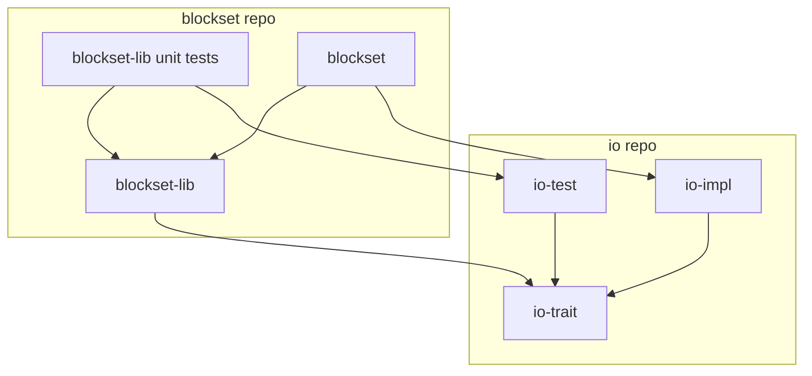

# Design

```mermaid
graph TD
  subgraph io repo
    io-trait
     io-impl & io-test --> io-trait
  end
  subgraph blockset repo
    blockset-lib-tests[blockset-lib unit tests] --> blockset-lib
    blockset --> blockset-lib --> io-trait
    blockset --> io-impl
    blockset-lib-tests --> io-test
  end
```
