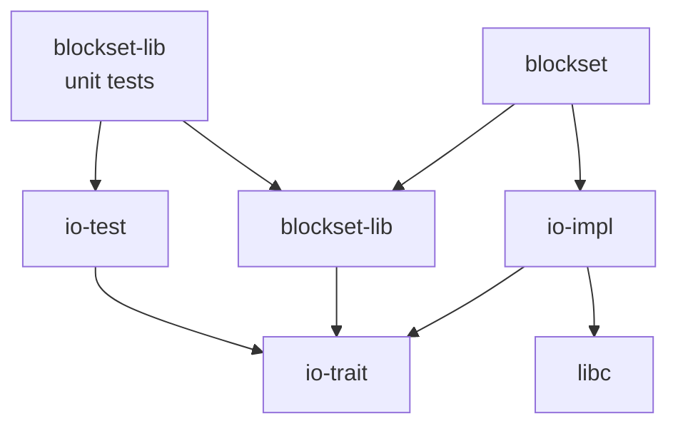

# Design

## Dependencies

```mermaid
graph TD
  io-trait
  io-impl & io-test --> io-trait
  io-impl --> libc
  blockset-lib-test[blockset-lib\nunit tests] --> io-test & blockset-lib
  blockset-lib --> io-trait
  blockset --> blockset-lib & io-impl
```
