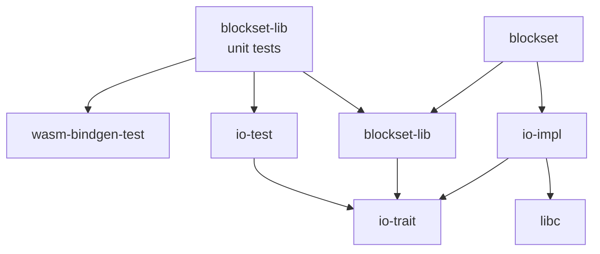
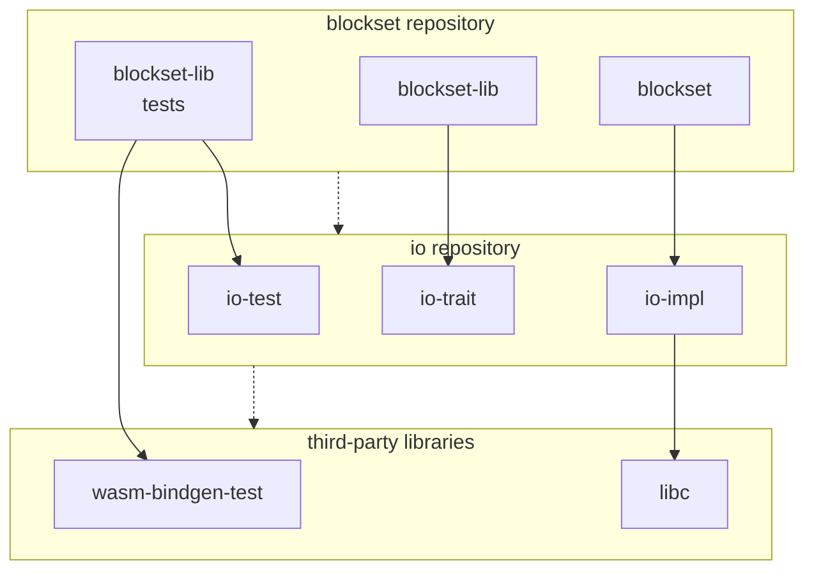

# Design

## Dependencies

```mermaid
graph TD
  io-trait
  io-impl & io-test --> io-trait
  io-impl --> libc
  blockset-lib-test[blockset-lib\nunit tests] --> wasm-bindgen-test & io-test & blockset-lib
  blockset-lib --> io-trait
  blockset --> blockset-lib & io-impl
```

```mermaid
graph TD
  subgraph br [blockset repository]
    blockset-lib-test[blockset-lib\ntests]
    blockset-lib
    blockset
  end
  subgraph ior [io repository]
    io-test
    io-trait
    io-impl
  end
  subgraph tpl [third-party libraries]
    wasm-bindgen-test
    libc
  end
  br -.-> ior
  ior -.-> tpl
  blockset-lib-test --> wasm-bindgen-test & io-test
  blockset-lib --> io-trait
  blockset --> io-impl
  io-impl --> libc
```
