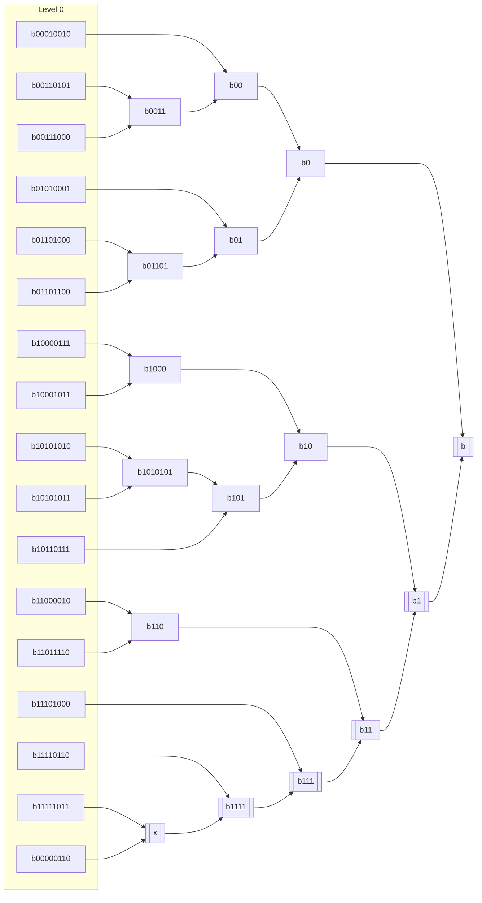
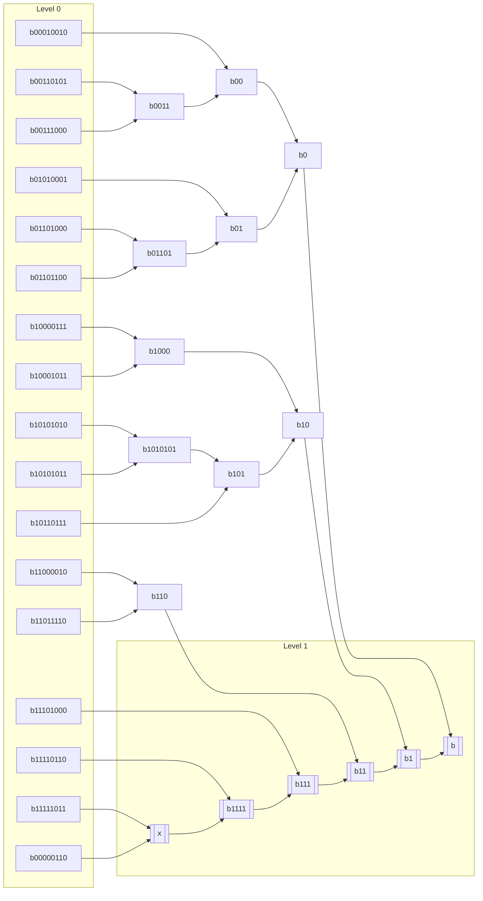

# Subtree Graph

```
00010010 00110101 00111000 01010001
01101000 01101100 10000111 10001011
10101010 10101011 10110111 11000010
11011110 11101000 11110110 11111011

00000110
```



## Highlighted level 1 nodes

